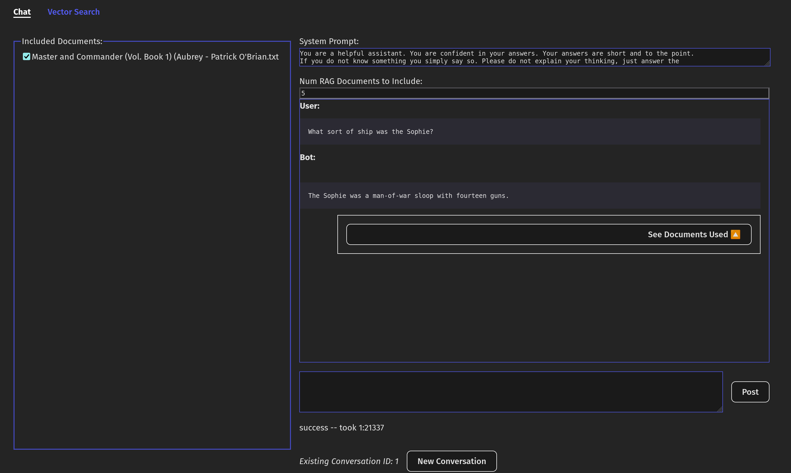

Spring AI Demo
---------------

This is an experiment, exploring the use of AI to query personal libraries and large documents locally. 

I want to explore several ideas and concepts:

1. Techniques for leveraging AI in a production environment: I am exploring the current
   SDKs and best practices suggested for use by Spring documentation.
2. RAG applied to novels: I would like to build a pipeline for ingesting and exposing large document
   to LLMs for querying. I would like to see if this can work on very unstructured works, such as novels. I have been
   trying various approaches for chunking and vectorization. Novels seem to present an interesting challenge, relative
   to, say, a forum or wiki page with a clear question answer structure. Creating chunks that lend to semantic search
   is tricky.
3. User interface paradigms: I have used large language models in the context of services like ChatGPT, Perplexity,
   and Open Web UI. I'd like to duplicate some of their approaches, such as streaming model output, especially useful with
   long-running thinking models. I'd also like to make the UI my own. This project does not have the same audience in mind.
   I am building it primarily as an exploration tool and want the UI to expose elements that help me experiment.
4. Limits of lean local hardware: I have been running various DeepSeek distillations on an RTX 2070. I want
   to determine how far you can push the smaller models that will run on this hardware

## Structure

1. spring-ai-demo-backend: An API backed by large language models and a vector database
2. spring-ai-demo-web-client: A React frontend which exposes visual ways to interact with the database
3. rag-experiments/vectorization-pipeline: The entry point for ingesting new documents. I would like to eventually shift
   this responsibility to spring-ai-demo-backend, but it's easier to experiment with the unstructured data in Python.

