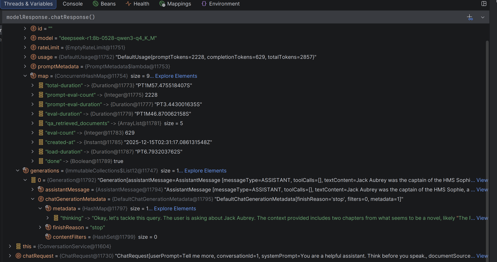

AI Document Query System - Backend 
=======================

## Requirements

* ollama
  * `ollama pull mxbai-embed-large`

## Running

Pay attention to `spring.ai.ollama.base-url` in application.properties. If for example it is set to
`spring.ai.ollama.base-url=http://192.168.1.23:11434`, make sure that machine is up, reachable, and has OLLAMA
running on it (see more below about configuring OLLAMA for network access).

```
./start-db.sh
./gradlew bootRun
```

## Tech Stack

### Migrations

Migrations are manged with flywheel and can be run with: `./gradlew flywayMigrate`

### JOOQ

We use JOOQ as an ORM. Source is generated from a schema.

We output generated src to `src/generated/jooq`. It would be more typical to generate this source
into the build directory as a dependency of the compile task and not check it in. This caused problems
those with the current simple setup. Migrations are part of the same module. To run migrations the code needs to compile
but to compile we need a schema to generate jooq.

To simplify this I'm checking in the generated jooq code. If you make changes to the schema manually run:
`./gradlew jooqGenerate` and checkin the changes with your migration.

### OLLAMA -- How To Open OLLAMA to Network requests

https://www.reddit.com/r/ollama/comments/1bwhgfx/trying_to_connect_to_the_api_over_the_network/

Run:

```
sudo systemctl edit ollama.service
```

Then in the top section, which allows for edits, place:

```
[Service]
Environment="OLLAMA_HOST=0.0.0.0"
```

You can test if it worked by checking the contents of:

```
cat /etc/systemd/system/ollama.service.d/override.conf
```

Now run:

```
sudo systemctl daemon-reload && sudo systemctl restart ollama
```

and test with:

```
curl http://192.168.1.105:11434/api/generate -d '
{  
"model": "tinyllama",  
"prompt": "Why is the blue sky blue?",  
"stream": false,
"options":{
  "num_thread": 8,
  "num_ctx": 2024
  }
}'  | jq .
```

## Verbose logging

In `application.properties` you can set `spring.ai.chat.logging-advisor.enabled=true` to enable the logging advisor
This will drump out the prompt inluding injected RAG docs. It can be quite verbose even for DEBUG level logs.

To see the full output, you will also need to have debugging enabled. You can also do this in `application.properites`
with logging.level.com.wininger.spring_ai_demo=DEBUG

## Accessing Swagger Documentation

• Swagger UI: http://localhost:8080/swagger-ui.html
• OpenAPI JSON: http://localhost:8080/api-docs

## Scratch

much grr https://docs.spring.io/spring-ai/reference/api/chat-memory.html
interesting: https://docs.spring.io/spring-ai/reference/observability/index.html





Taken from Here https://docs.spring.io/spring-ai/reference/api/chat/ollama-chat.html#_streaming_with_thinking

```
Flux<ChatResponse> stream = chatModel.stream(
    new Prompt(
        "Explain quantum entanglement",
        OllamaChatOptions.builder()
            .model("qwen3")
            .enableThinking()
            .build()
    ));

stream.subscribe(response -> {
    String thinking = response. response.getResult().getMetadata().get("thinking");
    String content = response.getResult().getOutput().getContent();

    if (thinking != null && !thinking.isEmpty()) {
        System.out.println("[Thinking] " + thinking);
    }
    if (content != null && !content.isEmpty()) {
        System.out.println("[Response] " + content);
    }
});
```
